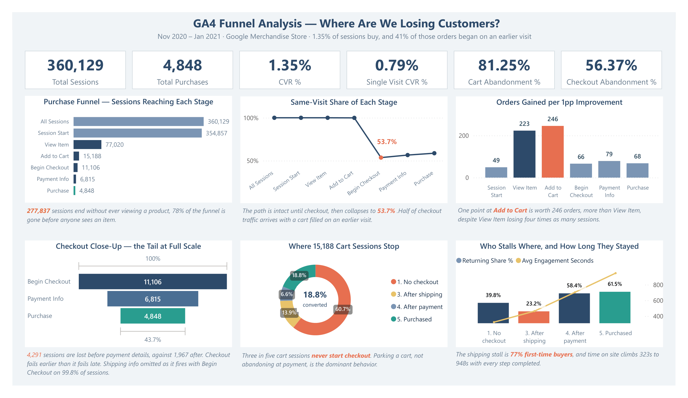

# GA4 Digital Marketing Funnel Analysis

**Where is the funnel leaking, and which channels actually drive revenue?**
End-to-end analysis of three months of real GA4 ecommerce data (Google
Merchandise Store) — from a 4.3 million-row BigQuery export to a four-page
Power BI dashboard.


---

## 🖥️ Dashboard Preview



> *Four pages, 44 DAX measures — funnel diagnosis, channel quality, visitor
> behaviour, product mix.*

---

## 🎯 The Problem

The Google Merchandise Store recorded 360,129 sessions over three months and
4,848 orders, a conversion rate of 1.35%.

The analysis locates where sessions stop, tests whether device, country, channel
or visit history explains it, and estimates how many orders each funnel step
would gain from a one-point improvement.

---

## 💡 Headline Insights

- **Two thirds of the loss happens before anyone sees a product.** 277,837
  sessions end without a product view. Checkout isn't the problem — 43.7% of
  sessions that start it finish it.
- **Buying here takes two visits.** Only 2,848 of 4,848 orders complete in one
  session, so single-visit conversion is 0.79% against 1.35% overall.
- **The biggest drop-off isn't the most valuable fix.** A point of improvement at
  Add to Cart returns **246 orders**, against 223 at View Item — which loses four
  times as many sessions.
- **A third of revenue is credited to a channel that isn't one.** The top revenue
  line is **92% the store's own hostnames** referring to each other. $116,247
  with no traceable source.
- **Repeat visitors are the business.** 17.5% of users return, and carry **82.2%
  of revenue**.

Plus three defects the analysis caught: revenue stops recording on 26 January,
bounce changes definition mid-window, and the product category field isn't stable
per product.

---

## 🧪 Methodology

**Validate first** — the session table is confirmed one row per session before any
rate is computed, and revenue reconciles along two independent paths to within $55.

**Test every explanation, including the ones that fail** — device, country,
channel and visit history each tested against bounce, conversion and order value.
Device explains nothing; channel explains engagement and exactly one funnel step.

**Re-test under a different definition** — bounce computed three ways. The device
result held; the monthly series didn't, which is how the January tracking break
surfaced.

---

## 🧰 What This Demonstrates

**SQL (BigQuery)** — `UNNEST` on nested event parameters and item arrays, `ARRAY_AGG` for session attribution, window functions with `QUALIFY`, persistent UDFs, conditional aggregation across 17 event types

**Power BI / DAX** — star schema with disconnected tables, `SWITCH` over `SELECTEDVALUE`, `CALCULATE` with `ALL` and `ALLSELECTED` for share denominators, 44 measures

**Analytics judgment** — ranking leaks by expected orders rather than size, attribution forensics on a channel that looked like a win, and documenting data defects rather than smoothing them over

---

## 🔧 Pipeline

```
BigQuery (query in place) → SQL table builds → 13 analysis files → Power BI → dashboard + deck
```

**Data:** `bigquery-public-data.ga4_obfuscated_sample_ecommerce` · Nov 2020 – Jan 2021 (92 days) · 4,295,584 events
**Outputs:** `sessions` (360,129 rows), `items` (16,003 rows), 15 SQL files, `.pbix`, 12-slide deck

> **Note:** GA4 `session_start` events carry no source parameter, so channel is
> rebuilt from the first non-null source across each session. This and other
> limitations are documented in [the SQL notes](sql/README.md).

---

## 📂 More Detail

- **SQL:** [`/sql`](sql/) — two table builds and thirteen analysis files, each carrying its results and what they mean
- **Dashboard:** [`.pbix`](dashboard/ga4_funnel_analysis.pbix) · [PDF export](dashboard/ga4_funnel_analysis.pdf)
- **Presentation:** [`GA4_Funnel_Analysis.pptx`](presentation/GA4_Funnel_Analysis.pptx)

---

**Rupsa Chaudhuri** · [LinkedIn](https://www.linkedin.com/in/rupsa-chaudhuri/) · [GitHub](https://github.com/rupsa723)
